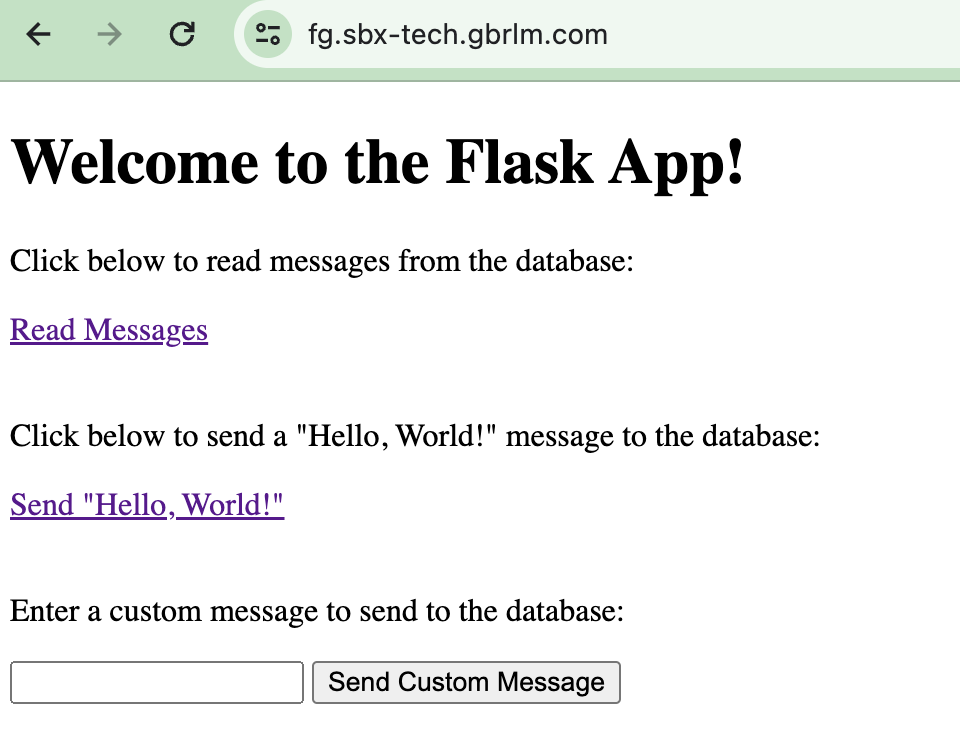
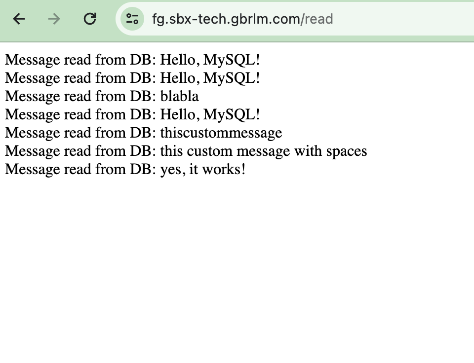
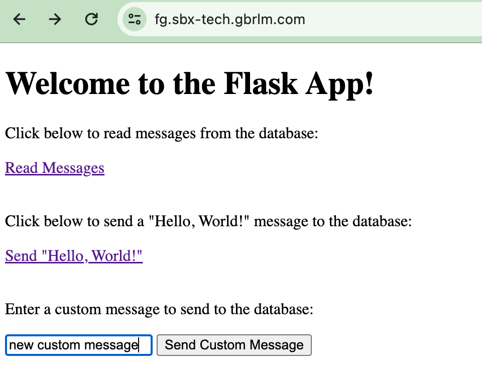
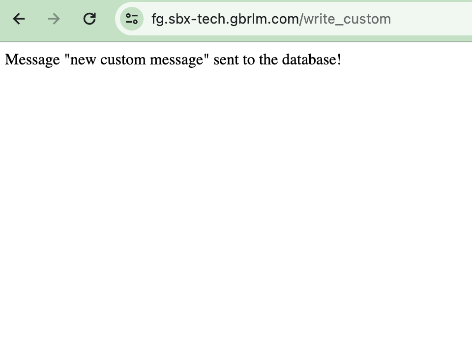
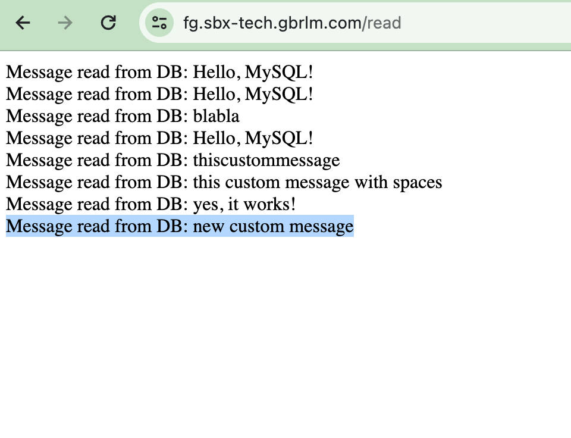

# fg-assignment

## Question #1

### Structure
In the `question1` directory you can find the following:
- `main.py`: the main script that was requested
- `requirements.txt`: the python pip requirements you need to have installed
- `test_infra`: terraform code that I used to deploy some EC2 instances with various AMIs in order to test the script
- `.python-version`: python version file for pyenv

### Usage
### Recommended setup
The script was created and test with Python 3.11. Create a Python virtual environment and install requirements.txt.
Here are the commands to run:
```
❯ cd question1
❯ python -m venv .venv
❯ source .venv/bin/activate
❯ pip install -r requirements.txt
```

### Run the script
The script assumes the AWS credentials for the account are available as environment variables!

Here is the help message of the script:
```
❯ python main.py -h
usage: main.py [-h] [--region REGION]

Pass the AWS region to the script.

options:
  -h, --help       show this help message and exit
  --region REGION  The AWS region to query. Default is us-east-1.
```

The script queries `us-east-1` if the region is not passed as a parameter to the script. Here is a running example:
```
❯ python main.py
{
    "ami-0e731c8a588258d0d": {
        "InstanceIds": [
            "i-03dedf8298c726ba7",
            "i-0074379a0d0e1ba43",
        ],
        "ImageDescription": "Amazon Linux 2023 AMI 2023.3.20240205.2 x86_64 HVM kernel-6.1",
        "ImageName": "al2023-ami-2023.3.20240205.2-kernel-6.1-x86_64",
        "ImageLocation": "amazon/al2023-ami-2023.3.20240205.2-kernel-6.1-x86_64",
        "OwnerID": "137112412989"
    },
    "ami-0c7217cdde317cfec": {
        "InstanceIds": [
            "i-075dfd0d4cf97755c",
            "i-06885b57e1dac5863",
            "i-010827e9478cfaf85",
        ],
        "ImageDescription": "Canonical, Ubuntu, 22.04 LTS, amd64 jammy image build on 2023-12-07",
        "ImageName": "ubuntu/images/hvm-ssd/ubuntu-jammy-22.04-amd64-server-20231207",
        "ImageLocation": "amazon/ubuntu/images/hvm-ssd/ubuntu-jammy-22.04-amd64-server-20231207",
        "OwnerID": "099720109477"
    },
    "ami-058bd2d568351da34": {
        "InstanceIds": [
            "i-00180ee584cf0b8d7",
            "i-07bdae17aaa1cf082",
            "i-0a2729ccb7f4b171c",
            "i-03e39ffe3c4324ba3",
        ],
        "ImageDescription": "Debian 12 (20231013-1532)",
        "ImageName": "debian-12-amd64-20231013-1532",
        "ImageLocation": "amazon/debian-12-amd64-20231013-1532",
        "OwnerID": "136693071363"
    }
}
```

### Test infra deployment (just in case)
I included an easy Terraform module to spin up some instances with the following AMIs:
```
  ami = {
    ubuntu22 = "ami-0c7217cdde317cfec" # ubuntu-jammy-22.04-amd64-server-20231207
    ubuntu20 = "ami-06aa3f7caf3a30282" # ubuntu-focal-20.04-amd64-server-20231025
    al2023   = "ami-0e731c8a588258d0d" # al2023-ami-2023.3.20240205.2-kernel-6.1-x86_64
    al2      = "ami-0cf10cdf9fcd62d37" # amzn2-ami-kernel-5.10-hvm-2.0.20240131.0-x86_64-gp2
    debian12 = "ami-058bd2d568351da34" # debian-12-amd64-20231013-1532
    suse15   = "ami-05efd9e66ddc3cf4b" # suse-sles-15-sp5-v20240129-hvm-ssd-x86_64
  }
```
Feel free to inspect the terraform-docs READMEs for the Terraform modules.

#### Usage
##### Terraform initialisation
This Terraform project is using S3 as state backend. If you need to use another backend, modify the `backend.tf` file accordingly.
The S3 backend configs can be passed from command line as arguments or, easier, from a file like below:
```
❯ cd question1/test_infra/
❯ cat config/remote.config
region         = "us-east-1"
bucket         = "example-tfstate"
dynamodb_table = "example-tfstate-lock"
key            = "fg-assignment/question1.tfstate"

❯ terraform init -backend-config=config/remote.config

Initializing the backend...
Initializing modules...
[...]
```

##### Terraform plan/apply
Terraform plan/apply requires the following variables.tfvars file. The `<os>_count` variables specify how many instances to create for each AMI. By default only one of each is created.
```
❯ cat config/variables.tfvars
aws_region         = "us-east-1"
security_group_ids = ["sg-071449ff50e38237d"]
subnet_id          = "subnet-0ef03867622a20291"
ubuntu22_count     = 10
ubuntu20_count     = 9
al2023_count       = 11
al2_count          = 4
debian12_count     = 7
suse15_count       = 6

❯ terraform plan -var-file config/variables.tfvars
Acquiring state lock. This may take a few moments...
module.test_infrastructure.module.ubuntu22[0].data.aws_partition.current: Reading...
module.test_infrastructure.module.ubuntu22[6].data.aws_partition.current: Reading...
module.test_infrastructure.module.ubuntu22[4].data.aws_partition.current: Reading...
module.test_infrastructure.module.ubuntu22[1].data.aws_partition.current: Reading...
[...]
module.test_infrastructure.module.ubuntu20[8].data.aws_partition.current: Read complete after 0s [id=aws]
module.test_infrastructure.module.al2[0].data.aws_partition.current: Read complete after 0s [id=aws]
module.test_infrastructure.module.ubuntu20[2].data.aws_partition.current: Read complete after 0s [id=aws]

Terraform used the selected providers to generate the following execution plan. Resource actions are indicated with the following symbols:
  + create

Terraform will perform the following actions:

  # module.test_infrastructure.module.al2[0].aws_instance.this[0] will be created
  + resource "aws_instance" "this" {
      + ami                                  = "ami-0cf10cdf9fcd62d37"
      + arn                                  = (known after apply)
      + associate_public_ip_address          = (known after apply)
      + availability_zone                    = (known after apply)
[...]
        }

      + timeouts {}
    }

Plan: 47 to add, 0 to change, 0 to destroy.
```


## Question #2

### Structure
In the `question2` directory you can find the following:
- `infrastructure`: contains the Terraform module that was requested
- `test_app`: a simple Flask app I deployed to test everything works as requested

`infrastructure` directory structure:
- `*.tf`: the tf files for the main module that deploys the infrastructure
- `modules/`: reusable modules for various infra components that are called used inside `infrastructure/main.tf`

I will not provide documentation for the deployment of the test_app, it's just some easy setup I came up quickly and it may be a bit messy...

### Terraform
#### Initialisation
This Terraform project is using S3 as state backend. If you need to use another backend, modify the `backend.tf` file accordingly.
The S3 backend configs can be passed from command line as arguments or, easier, from a file like below:
```
❯ cd question2/infrastructure/
❯ cat config/remote.config
region         = "us-east-1"
bucket         = "example-tfstate"
dynamodb_table = "example-tfstate-lock"
key            = "fg-assignment/question2.tfstate"

❯ terraform init -backend-config=config/remote.config

Initializing the backend...
Initializing modules...
[...]
```

#### Terraform plan/apply
Terraform plan/apply requires some input variables to be passed to the module. Please check `infrastructure/README.md` for the main module terraform-docs in order to explore all the variables.
Here is an example tfvar for the module:
```
❯ cat config/variables.tfvars
alb_enable_deletion_protection = false
alb_enable_tls                 = false
aws_region                     = "us-east-1"
az_count                       = 2
backend_webserver_port         = 8080
bastion_key_name               = "example-key"
bastion_ssh_allow_cidr_blocks  = "10.0.0.77/32"
vpc_cidr_block                 = "10.0.0.0/24"
webserver_key_name             = "example-key"

❯ terraform plan -var-file config/variables.tfvars
Acquiring state lock. This may take a few moments...
module.fg_database.module.rds.module.db_instance.random_id.snapshot_identifier[0]: Refreshing state... [id=O6YZ2Q]
[...]
```

#### Route53 and TLS support
##### Route53 A record
By default, the module will not create any A record in Route53 and the app will be available at the ALB DNS name created by default by AWS.
If you wish to manage the DNS in Route53, you can pass the following variables to the module:
```
alb_r53_dns_name = "www.example.com"
alb_r53_dns_zone = "example.com"
```

The module will not create the Route53 zone. It assumes it is already created under the same AWS account. When these two are configured, the module will create and alias A record that will point to the ALB.

##### TLS certificate
By default, the module will not configure TLS for the endpoint. In order two enable TLS configuration, pass the following variable to the module:
```
alb_enable_tls = true
```

###### TLS for existing ACM certificate
If you already have a certificate ARN for an existing ACM certificate, you can pass it through the `alb_certificate_arn` variable.

###### Configure new ACM certificate
The module is capable of creating a new ACM certificate for the DNS name you pass via `alb_r53_dns_name` variable.
```
alb_enable_tls   = true
alb_r53_dns_name = "www.example.com"
alb_r53_dns_zone = "example.com"
```
### Some screenshots with the app in action (we can go over in more details during the meeting)




